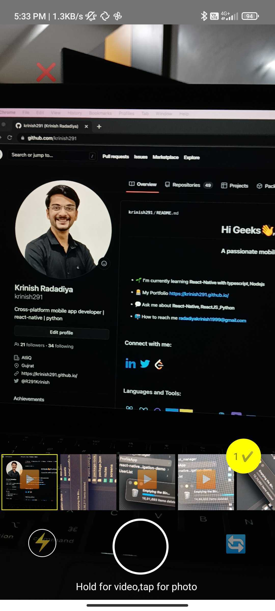
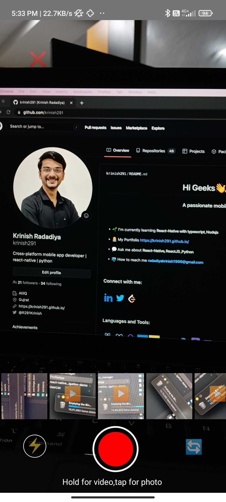

# React Native Awesome Camera

## Features List

<hr>

- High quality camera support in Android and iOS
- Select multiple images and videos from phone storage
- Capture images and videos using awesome camera
- Flash and camera zoom feature also available
- Customize theme color

<br>

<p align="center">
  
&nbsp; &nbsp; &nbsp; &nbsp;
  
</p>

<br>
### Installation and Setup steps

<hr>

```
yarn add react-native-awesome-camera
```

or

```
npm i react-native-awesome-camera
```

install dependencies

```
  yarn add react-native-permissions
  yarn add react-native-vision-camera
  yarn add github:BohdanSol/react-native-cameraroll.git
```

we are using **react-native-vision-camera**
<br><br>

### Android Changes

<hr>

Add below permission in your **AndroidManifest.xml**

```
    <uses-permission android:name="android.permission.CAMERA" />
    <uses-permission android:name="android.permission.RECORD_AUDIO" />
    <uses-permission android:name="android.permission.READ_EXTERNAL_STORAGE"/>
    <uses-permission android:name="android.permission.WRITE_EXTERNAL_STORAGE"/>
```
